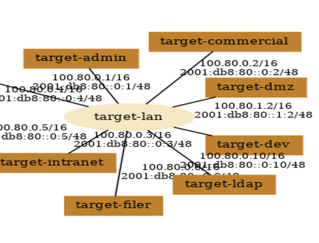
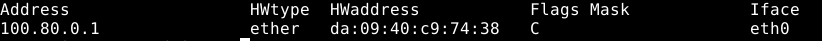
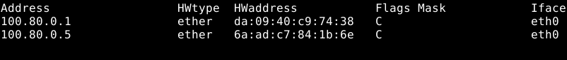
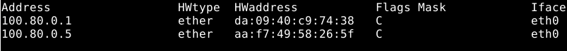
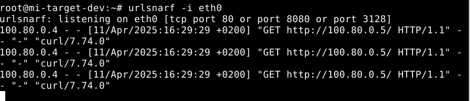
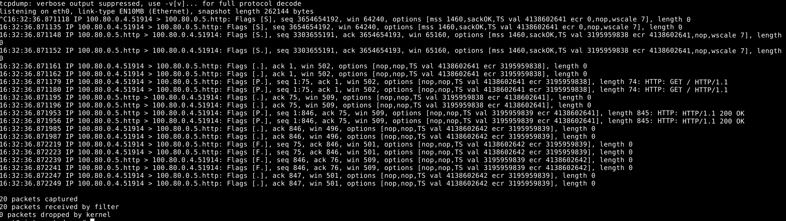
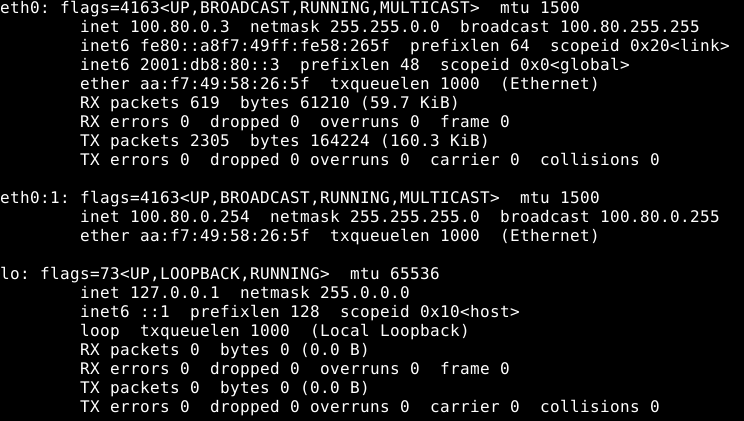
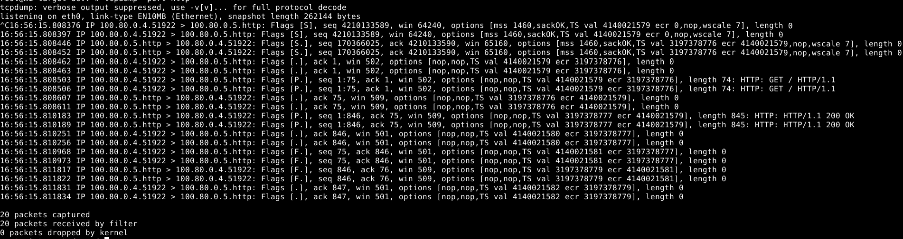

# TP1 MITM

Fait par : Chafai - Tonnerre - Delanghe - Fauvart - Hamad

## Préparation de l'environnement

Pour préparer notre environnement, on a eu besoin de:

- VirtualBox
- Une image de MI-LXC

## Familiarisation

Une fois cela en notre possession, on a démarré l'infrastructure

Après avoir effectué un print, voici le screen de l'infra :

## Plan d'Adressage

Cette petite entreprise n'a malheureusement aucune documentation concernant le plan d'adressage de leur réseau. Il va falloir le réaliser.

Voici ci-dessous la table d'adressage :

| Machine             | Rôle                          | Adresse IPv4   | Adresse MAC          |
|---------------------|-------------------------------|----------------|----------------------|
| target-router       | Routeur                       | 100.80.0.1     | 9a:af:e9:c0:7d:89    |
| target-admin        | Admin système                 | 100.80.0.4     | ba:94:28:ef:32:8b    |
| target-commercial   | Ordinateur du commercial      | 100.80.0.2     | 16:4c:84:39:e8:19    |
| target-dev          | Ordinateur du développeur     | 100.80.0.3     | 02:42:ac:11:00:0C    |
| target-dmz          | Zone démilitarisée (DMZ)      | 100.80.1.2     | ce:c9:fe:76:27:e5    |
| target-ldap         | Serveur LDAP                  | 100.80.0.10    | f2:6d:92:4f:52:85    |
| target-filer        | Serveur de stockage           | 100.80.0.6     | be:04:01:40:03:57    |
| target-intranet     | Serveur web intranet          | 100.80.0.5     | c2:89:d3:bc:d5:53    |

## ARP Spoofing

Pour rappel, voici notre définition de l'ARP Spoofing :

"L'attaque **ARP Spoofing** consiste à envoyer des messages **ARP falsifiés** sur un réseau local pour associer l'adresse MAC de l'attaquant à l'adresse IP d'une autre machine, permettant ainsi à l'attaquant **d'intercepter, modifier ou bloquer** le trafic réseau destiné à cette machine."

Voici l'output de la commande arp sur le poste de l'administrateur :

Après l'exécution du arpspoof, rien ne se passe car l'entrée dans la table ARP n'existe pas.

Après avoir exécuté le curl, on peut voir apparaître dans le watch :

Maintenant que nous avons une entrée dans la table ARP, le watch donne en output :

Cette MAC correspond bien à celle de notre Dev.

## Attaque MITM

A présent, nous allons réaliser une attaque dite de l'homme du milieu et tenter d'intercepter et d'altérer le trafic sur le réseau.

Après le curl sur l'intranet depuis le sysadmin, j'obtiens bien l'effet escompté. En effet, l'urlsnarf nous renvoie (après 5mn, ce que je trouve anormal) :

Après un tcpdump, voici l'output :

On peut très bien remarquer que les flux sont interceptés par le dev. En effet, on peut clairement voir une requête HTTP :
**IP 100.80.0.4.51914 > 100.80.0.5 HTTP: GET / HTTP/1.1**

Ainsi qu'une réponse :
**IP 100.80.0.5.http > 100.80.0.4 HTTP: HTTP/1.1 200 OK**

Par défaut, le kernel linux ignore les paquets qui ne lui sont pas explicitement adressés. Pour changer cela, on va créer une interface (eth0:1).

*Il est vrai qu'on aurait pu activer l’éventuel : mode promiscuous*

Voici le tcpdump après la création de l'interface :

### Que s'est-il passé ?

- Grâce à l'**ARP Spoofing**, le développeur s'est positionné **entre le sysadmin et le serveur intranet**.
- Le trafic HTTP non chiffré a transité via la machine du dev.
- tcpdump a capturé tout l'échange TCP+HTTP.
- Cela fonctionne même si les paquets ne sont pas directement adressés au dev, grâce à :
  - L’activation du forwarding
  - L’interface réseau alias eth0:1

### Mais pourquoi a-t-on tout de même reçu une réponse tout à l'heure ?

J'ai exécuté la commande : echo 1 | sudo tee /proc/sys/net/ipv4/ip_forward

Cela autorise la machine (le développeur) à faire passer les paquets qu’elle reçoit vers leur vraie destination.
Donc :

- Le target-admin envoie le paquet à l’adresse MAC du développeur (croyant que c’est le serveur intranet)
- Le développeur reçoit le paquet, puis le transmet au vrai 100.80.0.5 (grâce au forwarding)
- Le serveur intranet répond
- Et le développeur transmet la réponse au sysadmin.

On est donc un vrai relais transparent, donc tout fonctionne comme si de rien n’était.
