# TP2 - Firewall
**Groupe :** Chafai, Hamad, Fauvart, Delanghe, Tonnerre

## Topologie du routeur

### Question 1
Après avoir connecté à la machine "target-router" via `./mi-lxc.py attach target-router` et examiné les interfaces avec `ip addr`, nous avons identifié:

- **eth0** : Interface externe (WAN) - 100.64.0.10/24
  - Cette interface est connectée à Internet (côté ISP)
  - Elle gère le trafic venant de l'extérieur de l'entreprise

- **eth1** : Interface interne (LAN) - 100.80.0.1/16
  - Cette interface est connectée au réseau local de l'entreprise
  - Elle gère le trafic interne de l'entreprise

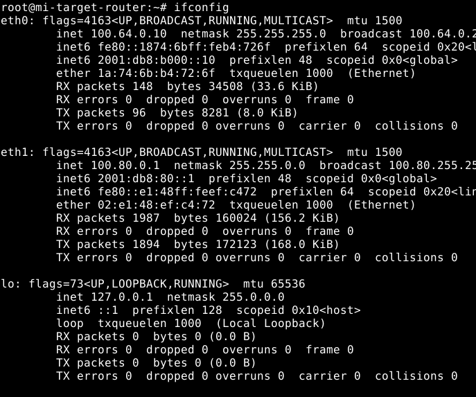

## Protection de la machine firewall

### Question 2
Pour interdire les connexions SSH (port 22) sur la machine target-router, nous avons appliqué la règle suivante :

```bash
iptables -A INPUT -p tcp --dport 22 -j DROP
```

Cette règle :
- S'applique à la chaîne INPUT (trafic entrant sur le routeur)
- Filtre le protocole TCP
- Cible spécifiquement le port de destination 22 (SSH)
- Utilise l'action DROP pour ignorer silencieusement les paquets

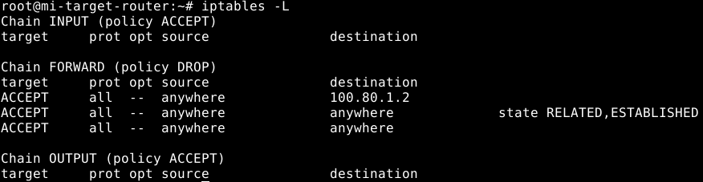

**Après l'ajout de ma règle DROP sur SSH** :

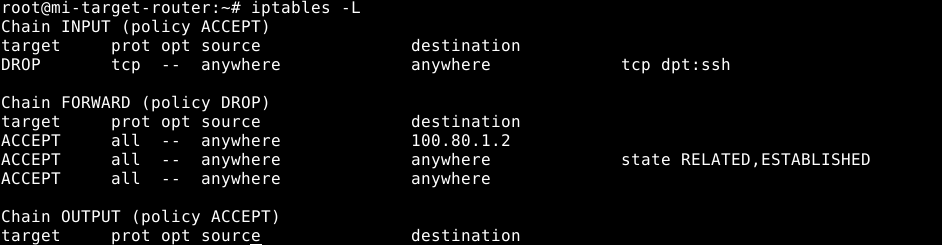

### Question 3
Le client SSH met un certain temps à répondre car l'action DROP fait que les paquets sont simplement ignorés sans notification. Le client continue donc d'envoyer des paquets et attend une réponse jusqu'à expiration du délai (timeout). Sans réponse explicite, le client SSH doit attendre que son propre mécanisme de temporisation se déclenche.

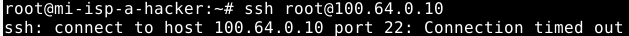

### Question 4
Après avoir remplacé DROP par REJECT :

```bash
iptables -A INPUT -p tcp --dport 22 -j REJECT
```

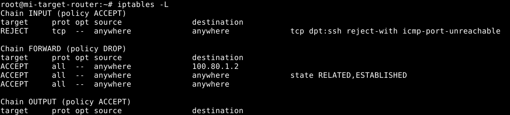

La différence observée est que le client SSH reçoit immédiatement une notification d'échec, sous forme d'un paquet ICMP "port unreachable" ou d'un paquet TCP RST.

En utilisant `tcpdump -i eth0 port 22`, nous observons que :
- Avec DROP : pas de réponse aux tentatives de connexion
- Avec REJECT : des paquets ICMP "port unreachable" sont renvoyés au client

Cette notification explicite permet au client de savoir immédiatement que la connexion est refusée plutôt que d'attendre un timeout.

**Avec DROP** :

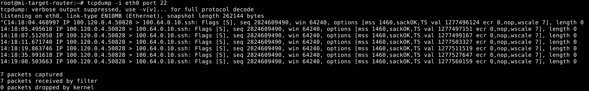

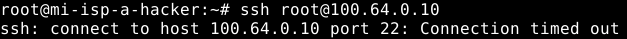

**Avec REJECT** :

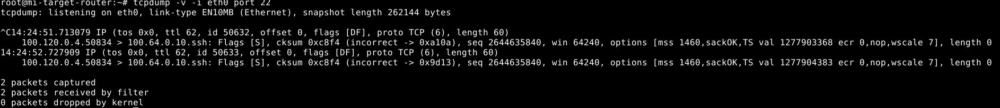

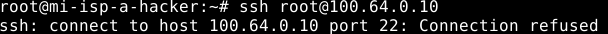

## Priorité des règles

### Question 5
Pour démontrer que l'ordre des règles est important, voici un exemple :

```bash
# Première règle : accepter tout le trafic SSH
iptables -A INPUT -p tcp --dport 22 -j ACCEPT

# Deuxième règle : rejeter tout le trafic SSH
iptables -A INPUT -p tcp --dport 22 -j REJECT
```

Dans ce cas, la première règle sera appliquée et le trafic SSH sera accepté. La deuxième règle ne sera jamais atteinte pour le trafic SSH.

Si nous inversons l'ordre :

```bash
# D'abord supprimer les règles existantes
iptables -F INPUT

# Première règle : rejeter tout le trafic SSH
iptables -A INPUT -p tcp --dport 22 -j REJECT

# Deuxième règle : accepter tout le trafic SSH
iptables -A INPUT -p tcp --dport 22 -j ACCEPT
```

Dans ce cas, tout le trafic SSH sera rejeté car la première règle sera appliquée et la seconde ne sera jamais atteinte.

**Si on accepte puis rejette** :

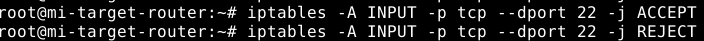

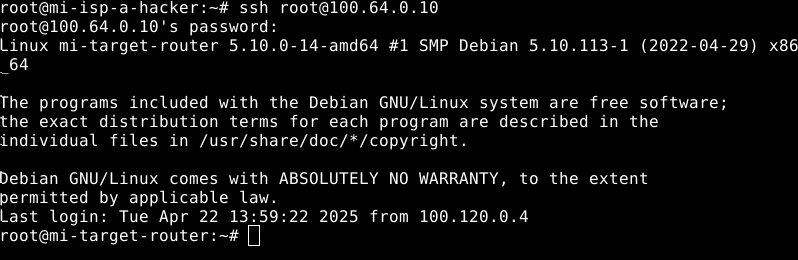

**Si on rejette puis accepte** :

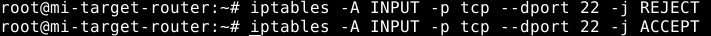

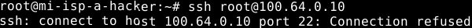

### Question 6
Pour autoriser SSH sur le routeur uniquement depuis le LAN interne, nous avons mis en place ces règles :

```bash
# Nettoyer les règles existantes
iptables -F INPUT

# Autoriser SSH depuis le réseau interne (100.80.0.0/16)
iptables -A INPUT -p tcp --dport 22 -s 100.80.0.0/16 -j ACCEPT

# Rejeter toutes les autres tentatives SSH
iptables -A INPUT -p tcp --dport 22 -j REJECT
```

Ces règles permettent aux machines du réseau interne (comme target-admin) d'accéder au routeur via SSH, tout en bloquant les tentatives depuis l'extérieur (comme depuis isp-a-hacker).

**Règles appliquées** :

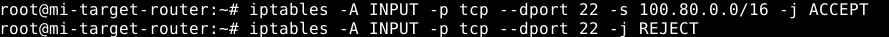

**Test de connexion SSH depuis le réseau interne (succès)** :

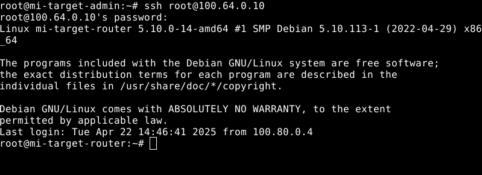

**Test de connexion SSH depuis l'extérieur (échec)** :

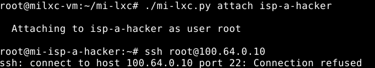

## Modules iptables

### Question 7
Pour autoriser uniquement les réponses aux connexions SSH entrantes, après avoir défini la politique par défaut de OUTPUT à DROP :

```bash
iptables -P OUTPUT DROP
iptables -A OUTPUT -m state --state ESTABLISHED,RELATED -p tcp --sport 22 -j ACCEPT
```

Cette règle :
- Utilise le module "state" pour identifier l'état des connexions
- Autorise uniquement les paquets correspondant à des connexions déjà établies (ESTABLISHED) ou liées (RELATED)
- S'applique uniquement au protocole TCP
- Filtre sur le port source 22 (réponses du service SSH)
- Permet au trafic correspondant de sortir (ACCEPT)

Ainsi, seules les réponses aux connexions SSH entrantes seront autorisées à sortir du firewall, tandis que les nouvelles connexions sortantes sont bloquées.

**Application des règles avec module state** :

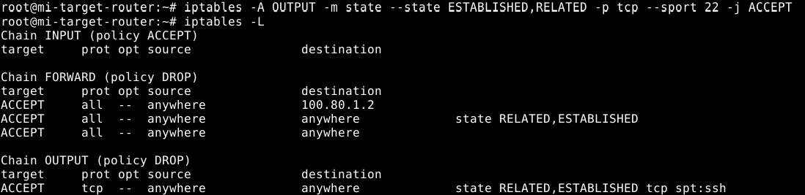

**Test montrant que seules les réponses SSH sont autorisées** :

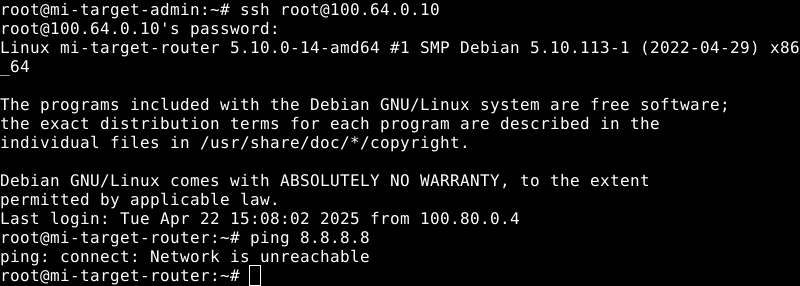

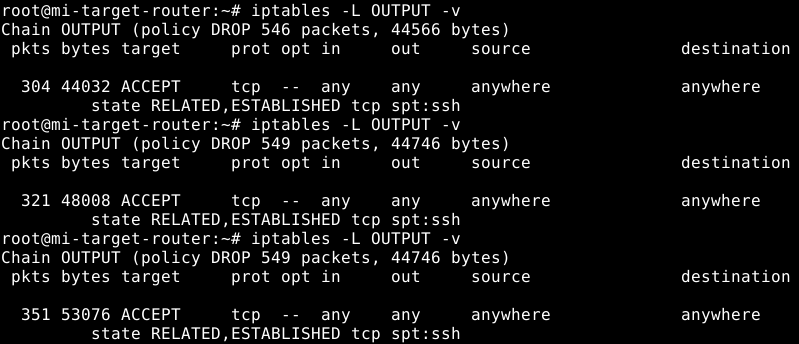

## Mise en place d'une politique de sécurité réseau

### Question 8
Matrice de flux pour le SI de l'entreprise, basée sur l'analyse des services actifs :

| Source \ Destination | Internet | target-router (100.80.0.1) | target-dmz (100.80.1.2) | target-admin (100.80.0.4) | target-commercial (100.80.0.2) | target-dev (100.80.0.3) | target-ldap (100.80.0.10) | target-filer (100.80.0.6) | target-intranet (100.80.0.5) |
|----------------------|----------|--------------|------------|--------------|-------------------|------------|-------------|--------------|-----------------|
| Internet             | X        | SSH (bloqué) | HTTP, HTTPS, DNS, SMTP, IMAP, IMAPS | Bloqué | Bloqué | Bloqué | Bloqué | Bloqué | Bloqué |
| target-router        | HTTP, HTTPS, DNS | X            | Tout       | Tout         | Tout              | Tout       | Tout        | Tout         | Tout            |
| target-dmz           | HTTP, HTTPS, DNS, SMTP | DNS, SSH   | X          | Bloqué       | Bloqué            | Bloqué     | LDAP        | Bloqué       | Bloqué          |
| target-admin         | HTTP, HTTPS | SSH        | SSH, HTTP, HTTPS, DNS | X       | SSH, RDP          | SSH, RDP   | LDAP, SSH   | SSH, SMB/CIFS     | SSH, HTTP      |
| target-commercial    | HTTP, HTTPS | Bloqué     | HTTP, HTTPS, SMTP | SSH       | X                 | Bloqué     | LDAP        | SSH, SMB/CIFS     | HTTP, HTTPS      |
| target-dev           | HTTP, HTTPS | Bloqué     | HTTP, HTTPS, SSH | Bloqué   | Bloqué            | X          | LDAP        | SSH, SMB/CIFS     | SSH, HTTP, HTTPS |
| target-ldap          | Bloqué   | Bloqué      | Bloqué     | SSH       | Bloqué            | Bloqué     | X           | Bloqué       | Bloqué          |
| target-filer         | Bloqué   | Bloqué      | Bloqué     | SSH       | Bloqué            | Bloqué     | LDAP        | X            | Bloqué          |
| target-intranet      | Bloqué   | Bloqué      | Bloqué     | SSH       | Bloqué            | Bloqué     | LDAP        | SSH, SMB/CIFS     | X               |

Légende des services :
- SSH: TCP/22
- HTTP: TCP/80
- HTTPS: TCP/443
- DNS: UDP/53, TCP/53
- SMTP: TCP/25
- IMAP: TCP/143
- IMAPS: TCP/993
- LDAP: TCP/389
- SMB/CIFS: TCP/445
- RDP: TCP/3389

Cette matrice se base sur l'analyse des services en cours d'exécution sur chaque machine (commande `netstat -laptn`). On remarque notamment :
- La DMZ expose plusieurs services vers Internet (HTTP, HTTPS, DNS, IMAP, SMTP)
- Le serveur LDAP est accessible depuis toutes les machines internes mais pas depuis Internet
- L'administrateur (target-admin) a accès à toutes les machines du réseau
- Le développeur (target-dev) doit pouvoir accéder au serveur intranet pour les déploiements
- Les communications entre zones sont strictement limitées aux services nécessaires

### Question 9
Pour segmenter le réseau et implémenter la politique de sécurité :

1. **Segmentation du réseau** :
   
   Modification du fichier `global.json` :
   ```json
   {
     "target": {
       "interfaces": [
         {"bridge": "transit-a", "ip": "100.64.0.10/24", "gw": "100.64.0.1"},
         {"bridge": "target-lan", "ip": "100.80.0.1/24"},
         {"bridge": "target-dmz", "ip": "100.80.1.1/24"},
         {"bridge": "target-admin", "ip": "100.80.2.1/24"},
         {"bridge": "target-services", "ip": "100.80.3.1/24"}
       ],
       "asdev": "eth0;eth1;eth2;eth3;eth4"
     }
   }
   ```

   Modification du fichier `groups/target/local.json` pour adapter les interfaces des machines internes :
   ```json
   "target-admin": {
     "interfaces": [
       {"bridge": "admin", "ip": "100.80.2.2/24", "gw": "100.80.2.1"}
     ]
   },
   "target-commercial": {
     "interfaces": [
       {"bridge": "lan", "ip": "100.80.0.2/24", "gw": "100.80.0.1"}
     ]
   },
   "target-dev": {
     "interfaces": [
       {"bridge": "lan", "ip": "100.80.0.3/24", "gw": "100.80.0.1"}
     ]
   },
   "target-dmz": {
     "interfaces": [
       {"bridge": "dmz", "ip": "100.80.1.2/24", "gw": "100.80.1.1"}
     ]
   },
   "target-ldap": {
     "interfaces": [
       {"bridge": "services", "ip": "100.80.3.2/24", "gw": "100.80.3.1"}
     ]
   },
   "target-filer": {
     "interfaces": [
       {"bridge": "services", "ip": "100.80.3.3/24", "gw": "100.80.3.1"}
     ]
   },
   "target-intranet": {
     "interfaces": [
       {"bridge": "services", "ip": "100.80.3.4/24", "gw": "100.80.3.1"}
     ]
   }
   ```
   **Sortie de la commande `./mi-lxc.py print` montrant l'ancienne topologie**
   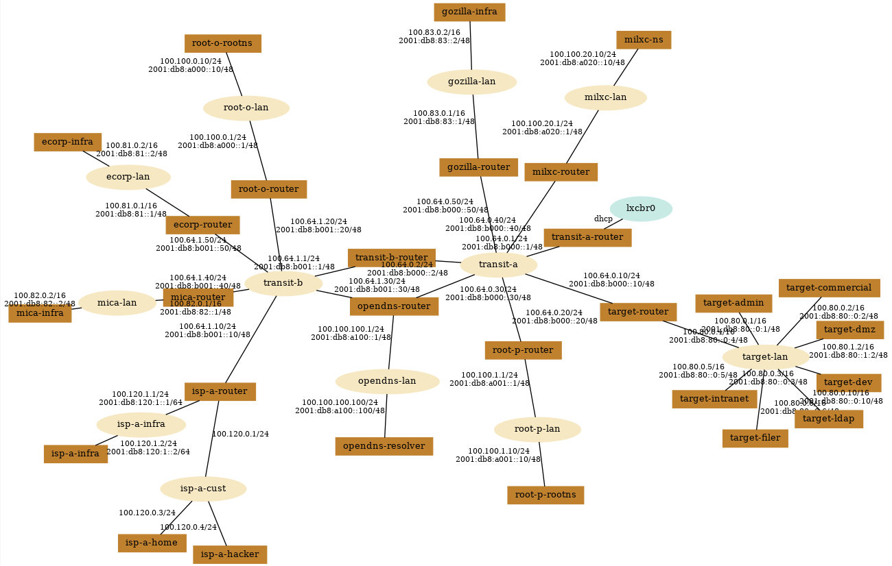

   **Sortie de la commande `./mi-lxc.py print` montrant la nouvelle topologie**
   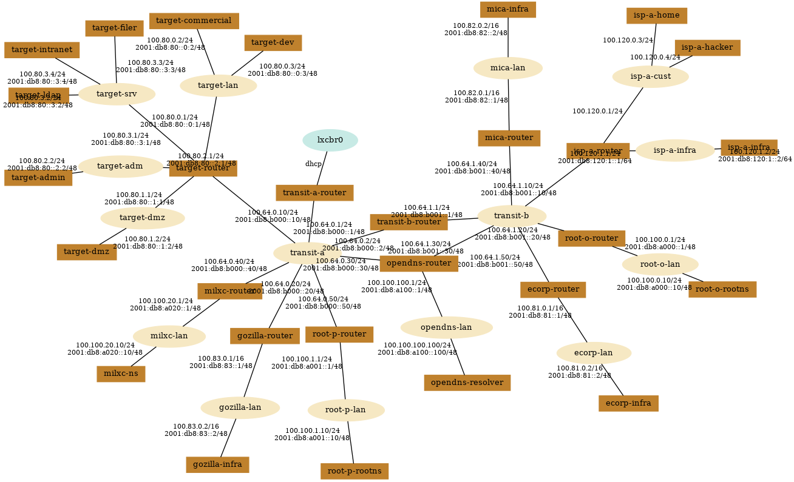

2. **Script de règles iptables** :

```bash
#!/bin/bash

# Nettoyage des règles existantes
iptables -F
iptables -X
iptables -t nat -F
iptables -t nat -X
iptables -t mangle -F
iptables -t mangle -X

# Politiques par défaut
iptables -P INPUT DROP
iptables -P FORWARD DROP
iptables -P OUTPUT ACCEPT

# Autoriser le trafic loopback
iptables -A INPUT -i lo -j ACCEPT
iptables -A OUTPUT -o lo -j ACCEPT

# Autoriser les connexions établies et liées
iptables -A INPUT -m state --state ESTABLISHED,RELATED -j ACCEPT
iptables -A FORWARD -m state --state ESTABLISHED,RELATED -j ACCEPT

# Autoriser SSH depuis le réseau admin uniquement
iptables -A INPUT -p tcp -s 100.80.2.0/24 --dport 22 -j ACCEPT

# Règles de routage entre les zones
# Internet vers DMZ
iptables -A FORWARD -i eth0 -o eth2 -p tcp -m multiport --dports 80,443,25,143,21 -j ACCEPT
iptables -A FORWARD -i eth0 -o eth2 -p udp --dport 53 -j ACCEPT

# DMZ vers Internet
iptables -A FORWARD -i eth2 -o eth0 -p tcp -m multiport --dports 80,443,53 -j ACCEPT
iptables -A FORWARD -i eth2 -o eth0 -p udp --dport 53 -j ACCEPT

# DMZ vers Services (uniquement LDAP)
iptables -A FORWARD -i eth2 -o eth4 -d 100.80.3.2 -p tcp --dport 389 -j ACCEPT

# LAN vers DMZ
iptables -A FORWARD -i eth1 -o eth2 -p tcp -m multiport --dports 80,443 -j ACCEPT

# LAN vers Services
iptables -A FORWARD -i eth1 -o eth4 -p tcp -m multiport --dports 389,445,80,443 -j ACCEPT

# Admin vers tous les réseaux
iptables -A FORWARD -i eth3 -j ACCEPT

# Dev vers Intranet (SSH pour déploiement)
iptables -A FORWARD -i eth1 -o eth4 -s 100.80.0.3 -d 100.80.3.4 -p tcp --dport 22 -j ACCEPT

# Services vers Services (communication interne)
iptables -A FORWARD -i eth4 -o eth4 -j ACCEPT

# Activer le masquerading (NAT) pour permettre aux machines internes d'accéder à Internet
iptables -t nat -A POSTROUTING -o eth0 -j MASQUERADE

# Journalisation des paquets rejetés
iptables -A FORWARD -j LOG --log-prefix "IPTABLES FORWARD REJECT: "
```

**Sortie de la commande `iptables-save` montrant les règles appliquées** :
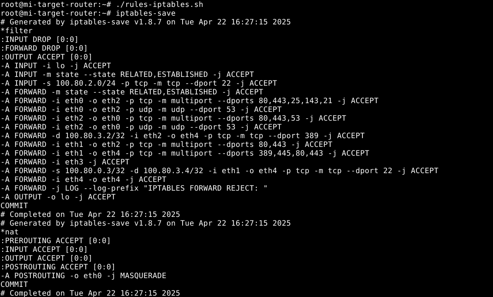

**Tests de connectivité entre les différentes zones** :

- target-ldap :
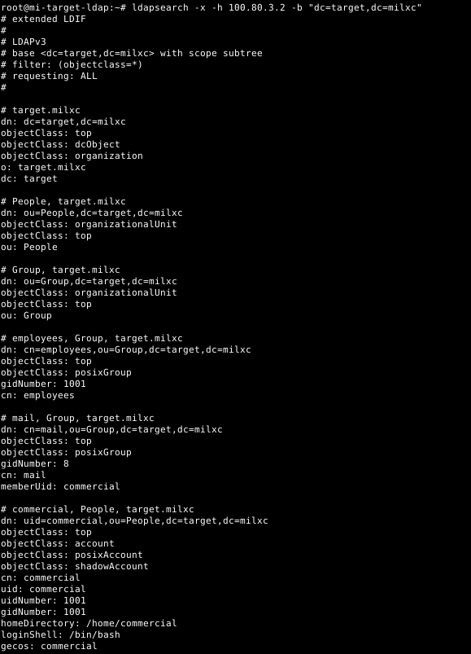
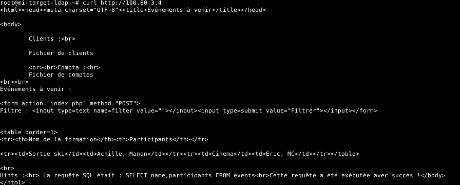

- target-dev :
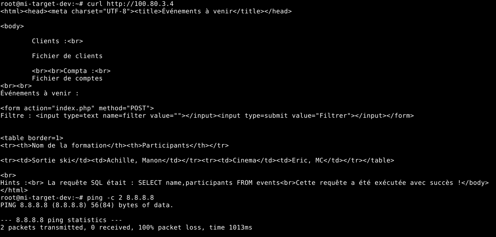

- isp-a-hacker :
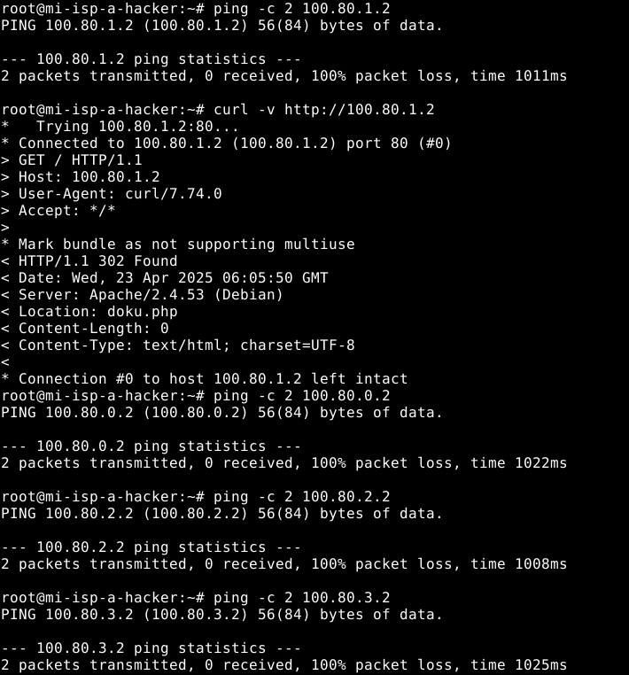

- target-admin :
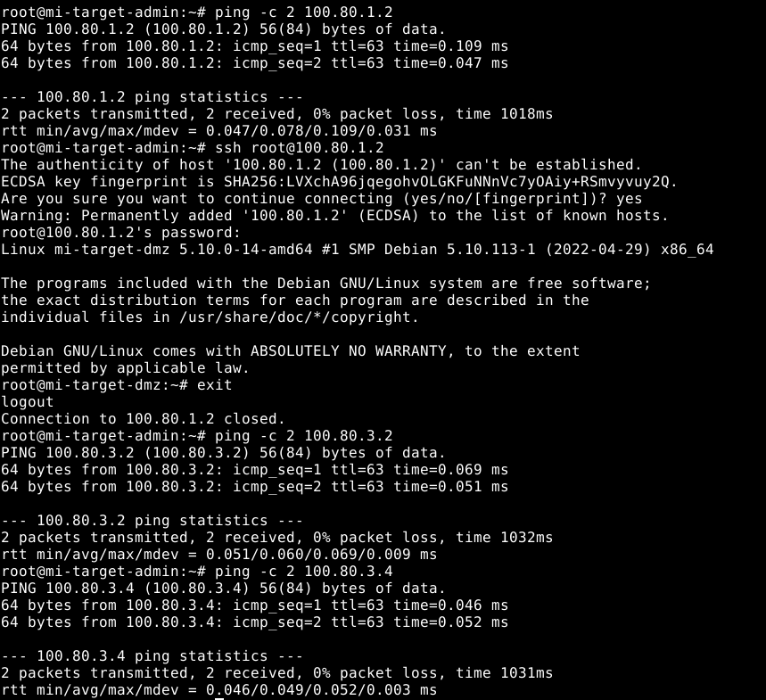

Après avoir créé ce script, nous l'avons exécuté et avons vérifié que les règles étaient correctement appliquées avec `iptables-save`. Nous avons également testé les connexions pour confirmer que notre politique fonctionnait comme prévu.

## Contournement de la politique

### Question 10
Le tunnel netcat entre target-dev et isp-a-home fonctionne selon le schéma suivant :

```
External Client        isp-a-home                target-dev            target-intranet
(isp-a-hacker)         (100.120.0.3)            (100.80.0.3)            (100.80.0.5)
      |                      |                        |                       |
      | HTTP Request         |                        |                       |
      | (port 8080)          |                        |                       |
      |--------------------->|                        |                       |
      |                      | forwarded via          |                       |
      |                      | netcat tunnel          |                       |
      |                      |----------------------->|                       |
      |                      |                        | HTTP Request          |
      |                      |                        |---------------------->|
      |                      |                        |                       |
      |                      |                        | HTTP Response         |
      |                      |                        |<----------------------|
      |                      | forwarded via          |                       |
      |                      | netcat tunnel          |                       |
      |                      |<-----------------------|                       |
      | HTTP Response        |                        |                       |
      | (port 8080)          |                        |                       |
      |<---------------------|                        |                       |
```

**Configuration du tunnel netcat sur isp-a-home** :

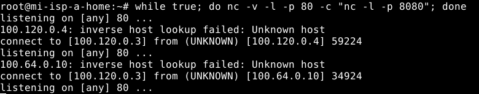

**Configuration du tunnel netcat sur target-dev** :

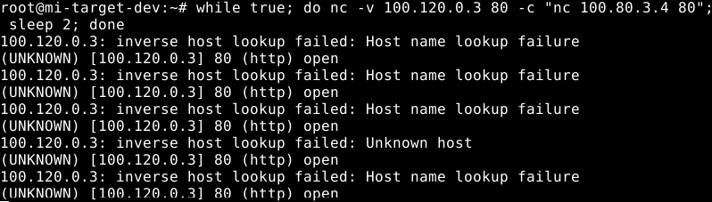

**Accès au serveur intranet depuis isp-a-hacker via le tunnel** :

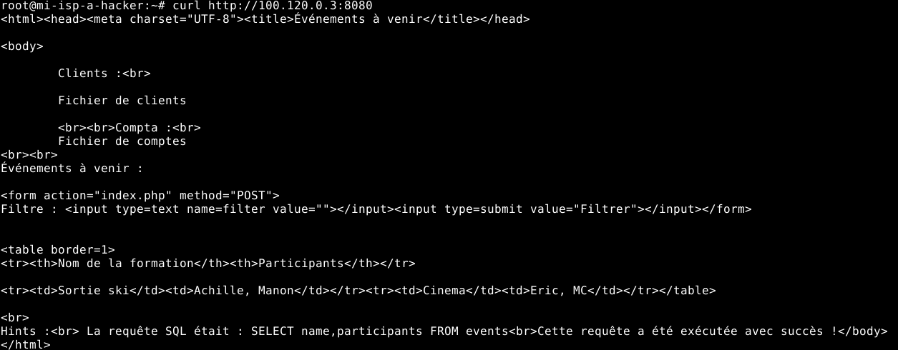


Ce tunnel contourne la politique de sécurité parce que :

1. La connexion sortante depuis target-dev vers isp-a-home est autorisée par la politique de filtrage (le développeur peut accéder à Internet)
2. Une fois ce tunnel établi, il crée un canal de communication qui n'est pas inspecté par le firewall
3. Tout le trafic passant par ce tunnel est encapsulé dans la connexion autorisée
4. Le firewall ne voit qu'une connexion TCP normale entre target-dev et isp-a-home, sans pouvoir inspecter le contenu

Ce type de contournement est difficile à détecter car :
- Il utilise des ports autorisés
- Il n'utilise pas de protocoles facilement identifiables
- Le trafic peut être chiffré (avec SSH par exemple)
- Il ressemble à une connexion légitime

Pour se protéger contre ce type d'attaque, il faudrait :
- Limiter strictement les connexions sortantes
- Utiliser une inspection approfondie des paquets (DPI)
- Monitorer les connexions prolongées ou inhabituelles
- Mettre en place des solutions EDR sur les postes clients

## Bonus

### FTP
Pour permettre l'usage du protocole FTP depuis l'extérieur vers le serveur FTP de la DMZ, nous avons ajouté les règles suivantes :

```bash
# Autoriser le port FTP contrôle
iptables -A FORWARD -i eth0 -o eth2 -p tcp --dport 21 -j ACCEPT

# Autoriser le port FTP données (mode actif)
iptables -A FORWARD -i eth0 -o eth2 -p tcp --dport 20 -j ACCEPT

# Autoriser le mode passif (ports éphémères)
iptables -A FORWARD -i eth0 -o eth2 -p tcp --dport 1024:65535 -m state --state RELATED -j ACCEPT
```

**Ajout des règles FTP** :

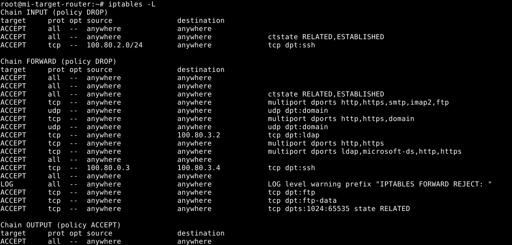

**Test de connexion FTP depuis l'extérieur** :

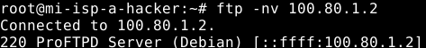

**Capture tcpdump montrant le trafic FTP passant par le firewall** :

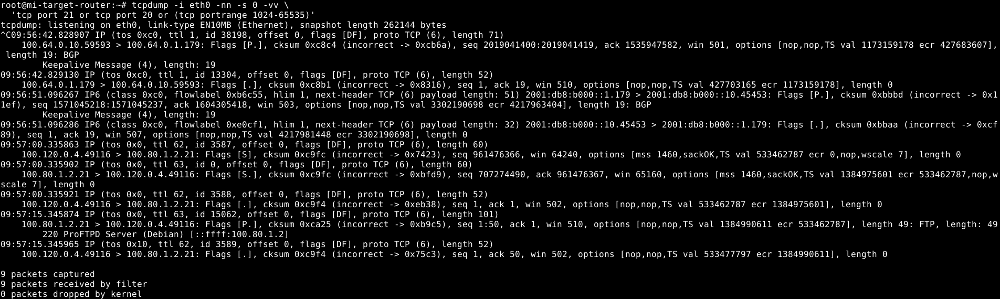

### Shorewall
Pour implémenter notre politique avec Shorewall, nous avons:

1. Installé Shorewall : `apt-get install shorewall`
2. Configuré les fichiers de base dans `/etc/shorewall/` :

**zones** :
```
fw      firewall
net     ipv4
lan     ipv4
dmz     ipv4
admin   ipv4
srv     ipv4
```

**interfaces** :
```
net     eth0    -
lan     eth1    -
dmz     eth2    -
admin   eth3    -
srv     eth4    -
```

**policy** :
```
fw      all     ACCEPT
net     all     DROP    INFO
lan     net     ACCEPT
lan     dmz     ACCEPT
lan     srv     ACCEPT
dmz     net     ACCEPT
dmz     srv     ACCEPT  INFO
admin   all     ACCEPT
srv     srv     ACCEPT
all     all     DROP    INFO
```

**rules** :
```
# (1) SSH vers le firewall depuis admin uniquement
SSH(ACCEPT)   admin      fw

# (2) Accès externes vers la DMZ
HTTP(ACCEPT)   net        dmz
HTTPS(ACCEPT)  net        dmz
DNS(ACCEPT)    net        dmz
SMTP(ACCEPT)   net        dmz
IMAP(ACCEPT)   net        dmz
FTP(ACCEPT)    net        dmz

# (3) DMZ vers Internet
HTTP(ACCEPT)   dmz        net
HTTPS(ACCEPT)  dmz        net
DNS(ACCEPT)    dmz        net

# (4) DMZ vers Services (uniquement LDAP sur 100.80.3.2)
ACCEPT         dmz        srv:100.80.3.2    tcp     389

# (5) LAN vers DMZ
ACCEPT         lan        dmz               tcp     80,443

# (6) LAN vers Services
ACCEPT         lan        srv               tcp     389,445,80,443

# (7) Dev (100.80.0.3) vers Intranet (100.80.3.4) en SSH
ACCEPT         lan:100.80.0.3  srv:100.80.3.4  tcp     22

# (8) Services interne à interne
ACCEPT         srv        srv

# (9) (optionnel) journalisation des rejets
# LOG            all        all
```

**Démarrage de Shorewall et vérification du statut** :

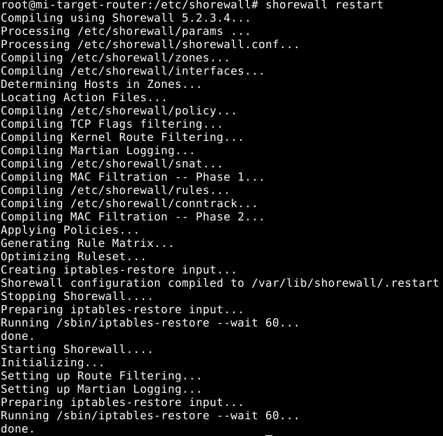

3. Activé Shorewall : `systemctl enable shorewall && systemctl start shorewall`

Shorewall offre une gestion beaucoup plus simple et lisible des règles de pare-feu, tout en générant les commandes iptables appropriées en arrière-plan. 

**Fichiers de règles iptables générées par Shorewall** :

shorewall-filter.rules :
```
*filter
:INPUT DROP [0:0]
:FORWARD DROP [0:0]
:OUTPUT ACCEPT [42:2954]
:admin-fw - [0:0]
:admin_frwd - [0:0]
:dmz-admin - [0:0]
:dmz-fw - [0:0]
:dmz-lan - [0:0]
:dmz-srv - [0:0]
:dmz_frwd - [0:0]
:dynamic - [0:0]
:lan-admin - [0:0]
:lan-fw - [0:0]
:lan_frwd - [0:0]
:logdrop - [0:0]
:logflags - [0:0]
:logreject - [0:0]
:net-admin - [0:0]
:net-dmz - [0:0]
:net-fw - [0:0]
:net-lan - [0:0]
:net-srv - [0:0]
:net_frwd - [0:0]
:sha-lh-b1cf911acfddc01e82d1 - [0:0]
:sha-rh-dd25120b6513dabbd699 - [0:0]
:shorewall - [0:0]
:srv-admin - [0:0]
:srv-dmz - [0:0]
:srv-fw - [0:0]
:srv-lan - [0:0]
:srv-net - [0:0]
:srv_frwd - [0:0]
:tcpflags - [0:0]
[35:3898] -A INPUT -i eth0 -j net-fw
[24:1656] -A INPUT -i eth1 -j lan-fw
[59:3677] -A INPUT -i eth2 -j dmz-fw
[4:270] -A INPUT -i eth3 -j admin-fw
[32:2188] -A INPUT -i eth4 -j srv-fw
[0:0] -A INPUT -i lo -j ACCEPT
[0:0] -A INPUT -m addrtype --dst-type BROADCAST -j DROP
[0:0] -A INPUT -m addrtype --dst-type ANYCAST -j DROP
[0:0] -A INPUT -m addrtype --dst-type MULTICAST -j DROP
[0:0] -A INPUT -m hashlimit --hashlimit-upto 1/sec --hashlimit-burst 10 --hashlimit-mode srcip --hashlimit-name lograte -j LOG --log-prefix "INPUT DROP " --log-level 6
[0:0] -A INPUT -j DROP
[79:4464] -A FORWARD -i eth0 -j net_frwd
[0:0] -A FORWARD -i eth1 -j lan_frwd
[82:5738] -A FORWARD -i eth2 -j dmz_frwd
[0:0] -A FORWARD -i eth3 -j admin_frwd
[0:0] -A FORWARD -i eth4 -j srv_frwd
[0:0] -A FORWARD -m addrtype --dst-type BROADCAST -j DROP
[0:0] -A FORWARD -m addrtype --dst-type ANYCAST -j DROP
[0:0] -A FORWARD -m addrtype --dst-type MULTICAST -j DROP
[0:0] -A FORWARD -m hashlimit --hashlimit-upto 1/sec --hashlimit-burst 10 --hashlimit-mode srcip --hashlimit-name lograte -j LOG --log-prefix "FORWARD DROP " --log-level 6
[0:0] -A FORWARD -j DROP
[4:270] -A admin-fw -m conntrack --ctstate INVALID,NEW,UNTRACKED -j dynamic
[0:0] -A admin-fw -p tcp -j tcpflags
[4:270] -A admin-fw -j ACCEPT
[0:0] -A admin_frwd -m conntrack --ctstate INVALID,NEW,UNTRACKED -j dynamic
[0:0] -A admin_frwd -p tcp -j tcpflags
[0:0] -A admin_frwd -o eth0 -j ACCEPT
[0:0] -A admin_frwd -o eth1 -j ACCEPT
[0:0] -A admin_frwd -o eth2 -j ACCEPT
[0:0] -A admin_frwd -o eth4 -j ACCEPT
[0:0] -A dmz-admin -m conntrack --ctstate RELATED,ESTABLISHED -j ACCEPT
[0:0] -A dmz-admin -m addrtype --dst-type BROADCAST -j DROP
[0:0] -A dmz-admin -m addrtype --dst-type ANYCAST -j DROP
[0:0] -A dmz-admin -m addrtype --dst-type MULTICAST -j DROP
[0:0] -A dmz-admin -m hashlimit --hashlimit-upto 1/sec --hashlimit-burst 10 --hashlimit-mode srcip --hashlimit-name lograte -j LOG --log-prefix "dmz-admin DROP " --log-level 6
[0:0] -A dmz-admin -j DROP
[56:3272] -A dmz-fw -m conntrack --ctstate INVALID,NEW,UNTRACKED -j dynamic
[0:0] -A dmz-fw -p tcp -j tcpflags
[3:405] -A dmz-fw -m conntrack --ctstate RELATED,ESTABLISHED -j ACCEPT
[0:0] -A dmz-fw -m addrtype --dst-type BROADCAST -j DROP
[0:0] -A dmz-fw -m addrtype --dst-type ANYCAST -j DROP
[0:0] -A dmz-fw -m addrtype --dst-type MULTICAST -j DROP
[56:3272] -A dmz-fw -m hashlimit --hashlimit-upto 1/sec --hashlimit-burst 10 --hashlimit-mode srcip --hashlimit-name lograte -j LOG --log-prefix "dmz-fw DROP " --log-level 6
[56:3272] -A dmz-fw -j DROP
[0:0] -A dmz-lan -m conntrack --ctstate RELATED,ESTABLISHED -j ACCEPT
[0:0] -A dmz-lan -m addrtype --dst-type BROADCAST -j DROP
[0:0] -A dmz-lan -m addrtype --dst-type ANYCAST -j DROP
[0:0] -A dmz-lan -m addrtype --dst-type MULTICAST -j DROP
[0:0] -A dmz-lan -m hashlimit --hashlimit-upto 1/sec --hashlimit-burst 10 --hashlimit-mode srcip --hashlimit-name lograte -j LOG --log-prefix "dmz-lan DROP " --log-level 6
[0:0] -A dmz-lan -j DROP
[0:0] -A dmz-srv -m conntrack --ctstate RELATED,ESTABLISHED -j ACCEPT
[0:0] -A dmz-srv -d 100.80.3.2/32 -p tcp -m tcp --dport 389 -j ACCEPT
[0:0] -A dmz-srv -m hashlimit --hashlimit-upto 1/sec --hashlimit-burst 10 --hashlimit-mode srcip --hashlimit-name lograte -j LOG --log-prefix "dmz-srv ACCEPT " --log-level 6
[0:0] -A dmz-srv -j ACCEPT
[0:0] -A dmz_frwd -m conntrack --ctstate INVALID,NEW,UNTRACKED -j dynamic
[82:5738] -A dmz_frwd -p tcp -j tcpflags
[82:5738] -A dmz_frwd -o eth0 -j ACCEPT
[0:0] -A dmz_frwd -o eth1 -j dmz-lan
[0:0] -A dmz_frwd -o eth3 -j dmz-admin
[0:0] -A dmz_frwd -o eth4 -j dmz-srv
[0:0] -A lan-admin -m conntrack --ctstate RELATED,ESTABLISHED -j ACCEPT
[0:0] -A lan-admin -m addrtype --dst-type BROADCAST -j DROP
[0:0] -A lan-admin -m addrtype --dst-type ANYCAST -j DROP
[0:0] -A lan-admin -m addrtype --dst-type MULTICAST -j DROP
[0:0] -A lan-admin -m hashlimit --hashlimit-upto 1/sec --hashlimit-burst 10 --hashlimit-mode srcip --hashlimit-name lograte -j LOG --log-prefix "lan-admin DROP " --log-level 6
[0:0] -A lan-admin -j DROP
[24:1656] -A lan-fw -m conntrack --ctstate INVALID,NEW,UNTRACKED -j dynamic
[0:0] -A lan-fw -p tcp -j tcpflags
[0:0] -A lan-fw -m conntrack --ctstate RELATED,ESTABLISHED -j ACCEPT
[0:0] -A lan-fw -m addrtype --dst-type BROADCAST -j DROP
[0:0] -A lan-fw -m addrtype --dst-type ANYCAST -j DROP
[0:0] -A lan-fw -m addrtype --dst-type MULTICAST -j DROP
[24:1656] -A lan-fw -m hashlimit --hashlimit-upto 1/sec --hashlimit-burst 10 --hashlimit-mode srcip --hashlimit-name lograte -j LOG --log-prefix "lan-fw DROP " --log-level 6
[24:1656] -A lan-fw -j DROP
[0:0] -A lan_frwd -m conntrack --ctstate INVALID,NEW,UNTRACKED -j dynamic
[0:0] -A lan_frwd -p tcp -j tcpflags
[0:0] -A lan_frwd -o eth0 -j ACCEPT
[0:0] -A lan_frwd -o eth2 -j ACCEPT
[0:0] -A lan_frwd -o eth3 -j lan-admin
[0:0] -A lan_frwd -o eth4 -j ACCEPT
[0:0] -A logdrop -j DROP
[0:0] -A logflags -m hashlimit --hashlimit-upto 1/sec --hashlimit-burst 10 --hashlimit-mode srcip --hashlimit-name lograte -j LOG --log-prefix "logflags DROP " --log-level 6 --log-ip-options
[0:0] -A logflags -j DROP
[0:0] -A logreject -m addrtype --src-type BROADCAST -j DROP
[0:0] -A logreject -s 224.0.0.0/4 -j DROP
[0:0] -A logreject -p igmp -j DROP
[0:0] -A logreject -p tcp -j REJECT --reject-with tcp-reset
[0:0] -A logreject -p udp -j REJECT --reject-with icmp-port-unreachable
[0:0] -A logreject -p icmp -j REJECT --reject-with icmp-host-unreachable
[0:0] -A logreject -j REJECT --reject-with icmp-host-prohibited
[0:0] -A net-admin -m conntrack --ctstate RELATED,ESTABLISHED -j ACCEPT
[0:0] -A net-admin -m addrtype --dst-type BROADCAST -j DROP
[0:0] -A net-admin -m addrtype --dst-type ANYCAST -j DROP
[0:0] -A net-admin -m addrtype --dst-type MULTICAST -j DROP
[0:0] -A net-admin -m hashlimit --hashlimit-upto 1/sec --hashlimit-burst 10 --hashlimit-mode srcip --hashlimit-name lograte -j LOG --log-prefix "net-admin DROP " --log-level 6
[0:0] -A net-admin -j DROP
[75:4224] -A net-dmz -m conntrack --ctstate RELATED,ESTABLISHED -j ACCEPT
[2:120] -A net-dmz -p tcp -m multiport --dports 80,443 -m comment --comment "HTTP, HTTPS" -j ACCEPT
[0:0] -A net-dmz -p udp -m udp --dport 53 -m comment --comment DNS -j ACCEPT
[2:120] -A net-dmz -p tcp -m multiport --dports 53,25,143,21 -m comment --comment "DNS, SMTP, IMAP, FTP" -j ACCEPT
[0:0] -A net-dmz -m addrtype --dst-type BROADCAST -j DROP
[0:0] -A net-dmz -m addrtype --dst-type ANYCAST -j DROP
[0:0] -A net-dmz -m addrtype --dst-type MULTICAST -j DROP
[0:0] -A net-dmz -m hashlimit --hashlimit-upto 1/sec --hashlimit-burst 10 --hashlimit-mode srcip --hashlimit-name lograte -j LOG --log-prefix "net-dmz DROP " --log-level 6
[0:0] -A net-dmz -j DROP
[0:0] -A net-fw -m conntrack --ctstate INVALID,NEW,UNTRACKED -j dynamic
[28:1722] -A net-fw -p tcp -j tcpflags
[35:3898] -A net-fw -m conntrack --ctstate RELATED,ESTABLISHED -j ACCEPT
[0:0] -A net-fw -m addrtype --dst-type BROADCAST -j DROP
[0:0] -A net-fw -m addrtype --dst-type ANYCAST -j DROP
[0:0] -A net-fw -m addrtype --dst-type MULTICAST -j DROP
[0:0] -A net-fw -m hashlimit --hashlimit-upto 1/sec --hashlimit-burst 10 --hashlimit-mode srcip --hashlimit-name lograte -j LOG --log-prefix "net-fw DROP " --log-level 6
[0:0] -A net-fw -j DROP
[0:0] -A net-lan -m conntrack --ctstate RELATED,ESTABLISHED -j ACCEPT
[0:0] -A net-lan -m addrtype --dst-type BROADCAST -j DROP
[0:0] -A net-lan -m addrtype --dst-type ANYCAST -j DROP
[0:0] -A net-lan -m addrtype --dst-type MULTICAST -j DROP
[0:0] -A net-lan -m hashlimit --hashlimit-upto 1/sec --hashlimit-burst 10 --hashlimit-mode srcip --hashlimit-name lograte -j LOG --log-prefix "net-lan DROP " --log-level 6
[0:0] -A net-lan -j DROP
[0:0] -A net-srv -m conntrack --ctstate RELATED,ESTABLISHED -j ACCEPT
[0:0] -A net-srv -m addrtype --dst-type BROADCAST -j DROP
[0:0] -A net-srv -m addrtype --dst-type ANYCAST -j DROP
[0:0] -A net-srv -m addrtype --dst-type MULTICAST -j DROP
[0:0] -A net-srv -m hashlimit --hashlimit-upto 1/sec --hashlimit-burst 10 --hashlimit-mode srcip --hashlimit-name lograte -j LOG --log-prefix "net-srv DROP " --log-level 6
[0:0] -A net-srv -j DROP
[4:240] -A net_frwd -m conntrack --ctstate INVALID,NEW,UNTRACKED -j dynamic
[79:4464] -A net_frwd -p tcp -j tcpflags
[0:0] -A net_frwd -o eth1 -j net-lan
[79:4464] -A net_frwd -o eth2 -j net-dmz
[0:0] -A net_frwd -o eth3 -j net-admin
[0:0] -A net_frwd -o eth4 -j net-srv
[0:0] -A shorewall -m recent --set --name %CURRENTTIME --mask 255.255.255.255 --rsource 
[0:0] -A srv-admin -m conntrack --ctstate RELATED,ESTABLISHED -j ACCEPT
[0:0] -A srv-admin -m addrtype --dst-type BROADCAST -j DROP
[0:0] -A srv-admin -m addrtype --dst-type ANYCAST -j DROP
[0:0] -A srv-admin -m addrtype --dst-type MULTICAST -j DROP
[0:0] -A srv-admin -m hashlimit --hashlimit-upto 1/sec --hashlimit-burst 10 --hashlimit-mode srcip --hashlimit-name lograte -j LOG --log-prefix "srv-admin DROP " --log-level 6
[0:0] -A srv-admin -j DROP
[0:0] -A srv-dmz -m conntrack --ctstate RELATED,ESTABLISHED -j ACCEPT
[0:0] -A srv-dmz -m addrtype --dst-type BROADCAST -j DROP
[0:0] -A srv-dmz -m addrtype --dst-type ANYCAST -j DROP
[0:0] -A srv-dmz -m addrtype --dst-type MULTICAST -j DROP
[0:0] -A srv-dmz -m hashlimit --hashlimit-upto 1/sec --hashlimit-burst 10 --hashlimit-mode srcip --hashlimit-name lograte -j LOG --log-prefix "srv-dmz DROP " --log-level 6
[0:0] -A srv-dmz -j DROP
[32:2188] -A srv-fw -m conntrack --ctstate INVALID,NEW,UNTRACKED -j dynamic
[0:0] -A srv-fw -p tcp -j tcpflags
[0:0] -A srv-fw -m conntrack --ctstate RELATED,ESTABLISHED -j ACCEPT
[0:0] -A srv-fw -m addrtype --dst-type BROADCAST -j DROP
[0:0] -A srv-fw -m addrtype --dst-type ANYCAST -j DROP
[0:0] -A srv-fw -m addrtype --dst-type MULTICAST -j DROP
[32:2188] -A srv-fw -m hashlimit --hashlimit-upto 1/sec --hashlimit-burst 10 --hashlimit-mode srcip --hashlimit-name lograte -j LOG --log-prefix "srv-fw DROP " --log-level 6
[32:2188] -A srv-fw -j DROP
[0:0] -A srv-lan -m conntrack --ctstate RELATED,ESTABLISHED -j ACCEPT
[0:0] -A srv-lan -m addrtype --dst-type BROADCAST -j DROP
[0:0] -A srv-lan -m addrtype --dst-type ANYCAST -j DROP
[0:0] -A srv-lan -m addrtype --dst-type MULTICAST -j DROP
[0:0] -A srv-lan -m hashlimit --hashlimit-upto 1/sec --hashlimit-burst 10 --hashlimit-mode srcip --hashlimit-name lograte -j LOG --log-prefix "srv-lan DROP " --log-level 6
[0:0] -A srv-lan -j DROP
[0:0] -A srv-net -m conntrack --ctstate RELATED,ESTABLISHED -j ACCEPT
[0:0] -A srv-net -m addrtype --dst-type BROADCAST -j DROP
[0:0] -A srv-net -m addrtype --dst-type ANYCAST -j DROP
[0:0] -A srv-net -m addrtype --dst-type MULTICAST -j DROP
[0:0] -A srv-net -m hashlimit --hashlimit-upto 1/sec --hashlimit-burst 10 --hashlimit-mode srcip --hashlimit-name lograte -j LOG --log-prefix "srv-net DROP " --log-level 6
[0:0] -A srv-net -j DROP
[0:0] -A srv_frwd -m conntrack --ctstate INVALID,NEW,UNTRACKED -j dynamic
[0:0] -A srv_frwd -p tcp -j tcpflags
[0:0] -A srv_frwd -o eth0 -j srv-net
[0:0] -A srv_frwd -o eth1 -j srv-lan
[0:0] -A srv_frwd -o eth2 -j srv-dmz
[0:0] -A srv_frwd -o eth3 -j srv-admin
[0:0] -A tcpflags -p tcp -m tcp --tcp-flags FIN,SYN,RST,PSH,ACK,URG FIN,PSH,URG -g logflags
[0:0] -A tcpflags -p tcp -m tcp --tcp-flags FIN,SYN,RST,PSH,ACK,URG NONE -g logflags
[0:0] -A tcpflags -p tcp -m tcp --tcp-flags SYN,RST SYN,RST -g logflags
[0:0] -A tcpflags -p tcp -m tcp --tcp-flags FIN,RST FIN,RST -g logflags
[0:0] -A tcpflags -p tcp -m tcp --tcp-flags FIN,SYN FIN,SYN -g logflags
[0:0] -A tcpflags -p tcp -m tcp --tcp-flags FIN,PSH,ACK FIN,PSH -g logflags
[0:0] -A tcpflags -p tcp -m tcp --sport 0 --tcp-flags FIN,SYN,RST,ACK SYN -g logflags
COMMIT
```
shorewall-nat.rules :
```
*nat
:PREROUTING ACCEPT [120:7626]
:INPUT ACCEPT [4:270]
:OUTPUT ACCEPT [10:712]
:POSTROUTING ACCEPT [14:952]
[0:0] -A POSTROUTING -s 100.80.0.0/16 -o eth0 -j MASQUERADE
COMMIT

```
